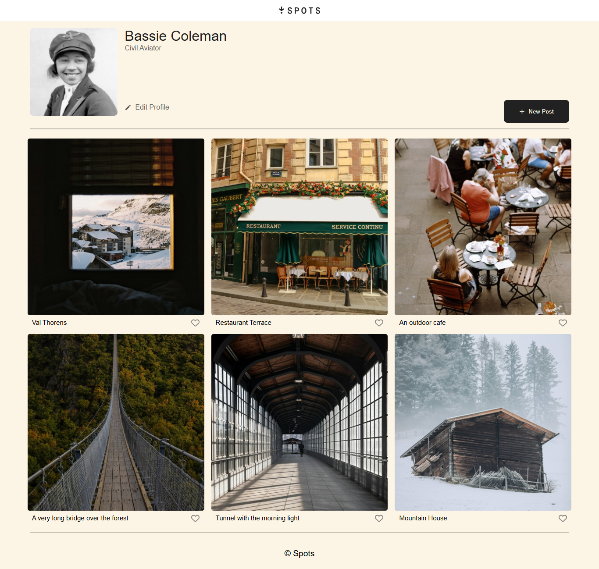

# Insta-Spots
A React conversion of an Instagram-like gallery app, originally built with HTML, CSS, and JavaScript.

## 📝 About
This project is a React-based version of an Instagram-style gallery app.  
It was converted from a static HTML, CSS, and JavaScript implementation as part of an AltSchool assignment.

## ✨ Features

- View a gallery of images
- Edit user profile (name, job, profile picture)
- Add new posts (with image upload or URL)
- Like/unlike gallery images
- Responsive design

## 📸 Screenshot

